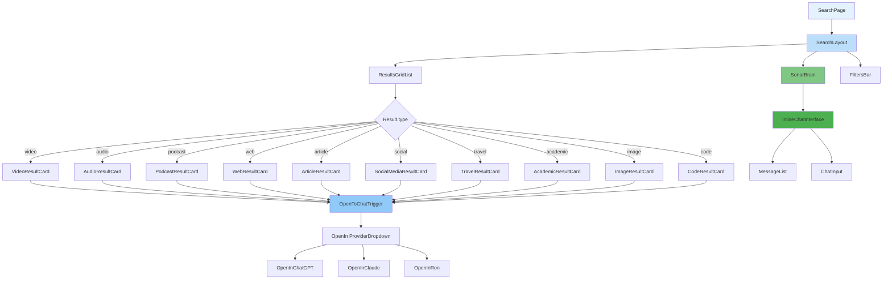
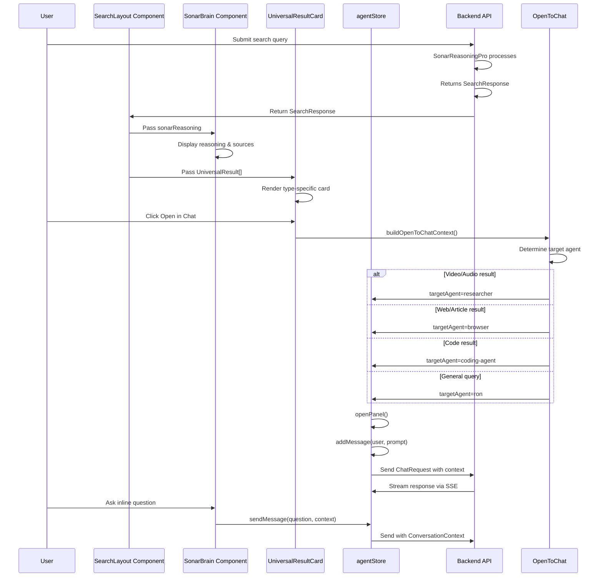

# Search Results Architecture Document
## Data Structures, Component Design, and Open-to-Chat Integration

**Document Created:** 2025-12-30  
**Purpose:** Complete architecture specification for Search Results page including TypeScript interfaces, component hierarchy, data flow, and agent routing strategy.

---

## Table of Contents
1. [Research Findings](#research-findings)
2. [TypeScript Interfaces](#typescript-interfaces)
3. [Component Architecture](#component-architecture)
4. [Data Flow](#data-flow)
5. [Open-to-Chat Routing Strategy](#open-to-chat-routing-strategy)
6. [Component Specifications](#component-specifications)

---

## Research Findings

### Existing Codebase Patterns

#### 1. Search Result Types ([`src/components/ai-elements/chain-of-thought-search.tsx`](../src/components/ai-elements/chain-of-thought-search.tsx))
- **Existing `SearchResult` interface** (lines 32-44):
  ```typescript
  export interface SearchResult {
    id: string
    title: string
    url: string
    snippet?: string
    favicon?: string
    thumbnail?: string
    date?: string
    author?: string
    source?: string
    relevanceScore?: number
    metadata?: Record<string, any>
  }
  ```
- **Supported Providers** (lines 18-31): brave, perplexity, pubmed, openfda, datacommons, pophive, cms, apify, google-flights, airbnb, arxiv, program-integrity
- **Detection Pattern**: [`detectSearchProvider()`](../src/components/ai-elements/chain-of-thought-search.tsx:582-611) maps tool names to providers

#### 2. AI Elements Types ([`src/components/ai-elements/types.ts`](../src/components/ai-elements/types.ts))
- **`AIChainOfThought`** (lines 102-106): Has id, isComplete, and steps array
- **`AIChainOfThoughtStep`** (lines 108-129): Supports nested searchResults, tool executions, retrieval, browser actions, etc.
- **`AISearchResult`** (lines 131-136): Basic result with id, title, url, snippet
- **`AISource`** (lines 62-68): Source with href, title, snippet, favicon

#### 3. Agent Stream Types ([`src/types/agent.ts`](../src/types/agent.ts))
- **`AgentStreamEvent`** (lines 94-124): Contains `reasoningText` for chain-of-thought streaming
- **`ConversationContext`** (lines 75-88): Supports userInterests, userPreferences, currentUrl, pageContent, selectedText
- **`ChatRequest`** (lines 142-158): Accepts prompt, context, tools, model, temperature

#### 4. Stream Parser ([`src/utils/search-stream-parser.ts`](../src/utils/search-stream-parser.ts))
- **`ToolCall`/`ToolResult`** parsing patterns for MCP tools
- **`SearchStreamProcessor`** class for managing search state
- Provider detection via [`SEARCH_TOOL_PATTERNS`](../src/utils/search-stream-parser.ts:49-95)

#### 5. Agent Store ([`src/stores/agentStore.ts`](../src/stores/agentStore.ts))
- Uses **Zustand** for state management
- **`sendMessage()`** (line 361-416): Accepts content and ConversationContext
- **`AskRon`** flow: Selects context → generates prompt options → executes with context

#### 6. Open-to-Chat Pattern ([`src/components/ai-elements/open-in-chat.tsx`](../src/components/ai-elements/open-in-chat.tsx))
- **Provider context**: `OpenInContext.Provider` wraps query
- **External platforms**: github, scira, chatgpt, claude, t3, v0, cursor
- **Pattern**: Each provider has `createUrl(query)` function

---

## TypeScript Interfaces

**File Location:** [`src/types/search.ts`](../src/types/search.ts) (to be created)

### Core Types

```typescript
// Search Provider Types
export type SearchProvider =
  | 'brave'
  | 'perplexity'
  | 'pubmed'
  | 'openfda'
  | 'datacommons'
  | 'pophive'
  | 'cms'
  | 'apify'
  | 'google-flights'
  | 'airbnb'
  | 'arxiv'
  | 'program-integrity'
  | 'sonar'

// Result Type Discriminator
export type ResultType =
  | 'video'
  | 'audio'
  | 'podcast'
  | 'web'
  | 'article'
  | 'social'
  | 'travel'
  | 'academic'
  | 'image'
  | 'code'
```

### SearchResponse Interface

```typescript
export interface SearchResponse {
  id: string
  query: string
  timestamp: number
  
  // SonarReasoningPro response
  sonarReasoning?: SonarReasoningResponse
  
  // Raw results (legacy/backward compatibility)
  results?: UniversalResult[]
  
  // Search metadata
  totalCount?: number
  duration?: number
  
  // State
  isComplete: boolean
  error?: string
}
```

### SonarReasoning Response Interface

```typescript
export interface SonarReasoningResponse {
  // Core reasoning
  reasoning: string
  chainOfThought: ChainOfThought
  
  // Confidence and quality
  confidence: number
  qualityScore?: number
  
  // Sources/references
  sources: SonarSource[]
  
  // Summary of results
  summary?: string
  
  // Related queries (for expanding search)
  relatedQueries?: string[]
  
  // Metadata
  modelUsed?: string
  tokensUsed?: number
}

export interface ChainOfThought {
  steps: ChainOfThoughtStep[]
}

export interface ChainOfThoughtStep {
  id: string
  label: string
  description?: string
  status: 'pending' | 'running' | 'complete' | 'error'
  timestamp?: number
  
  // Nested content
  reasoning?: string
  searchResults?: UniversalResult[]
  tools?: string[]
}

export interface SonarSource {
  id: string
  url: string
  title: string
  snippet: string
  
  // Relevance to query
  relevanceScore: number
  
  // Source metadata
  type: ResultType
  domain?: string
  author?: string
  date?: string
  
  // Trust signals
  confidence?: number
  credibilityScore?: number
}
```

### Universal Result Union Type

```typescript
export type UniversalResult =
  | VideoResult
  | AudioResult
  | PodcastResult
  | WebResult
  | ArticleResult
  | SocialMediaResult
  | TravelResult
  | AcademicResult
  | ImageResult
  | CodeResult
```

### Result Type-Specific Interfaces

#### VideoResult
```typescript
export interface VideoResult {
  id: string
  type: 'video'
  
  // Core content
  title: string
  url: string
  thumbnail: string
  duration: number
  
  // Embed capabilities
  embedUrl?: string
  embedType?: 'youtube' | 'vimeo' | 'dailymotion' | 'generic'
  
  // Transcript
  transcriptUrl?: string
  hasTranscript?: boolean
  
  // Metadata
  platform?: 'youtube' | 'vimeo' | 'tiktok' | 'instagram-reels' | 'generic'
  uploader?: string
  uploaderUrl?: string
  viewCount?: number
  publishedAt?: string
  relevanceScore?: number
  
  // Open-to-Chat metadata
  metadata?: Record<string, unknown>
}
```

#### Audio/PodcastResult
```typescript
export interface AudioResult {
  id: string
  type: 'audio'
  
  // Core content
  title: string
  url: string
  audioUrl: string
  duration: number
  artwork?: string
  
  // Metadata
  artist?: string
  album?: string
  genre?: string
  
  // Transcript
  transcriptUrl?: string
  hasTranscript?: boolean
  
  // Platform
  platform?: 'spotify' | 'apple-podcasts' | 'soundcloud' | 'generic'
  
  relevanceScore?: number
  metadata?: Record<string, unknown>
}

export interface PodcastResult {
  id: string
  type: 'podcast'
  
  // Core content
  title: string
  url: string
  audioUrl: string
  duration: number
  artwork?: string
  
  // Episode info
  episodeNumber?: number
  seasonNumber?: number
  publishedAt?: string
  
  // Show info
  showTitle?: string
  showUrl?: string
  host?: string
  hostUrl?: string
  
  // Transcript
  transcriptUrl?: string
  hasTranscript?: boolean
  
  // Platform
  platform?: 'spotify' | 'apple-podcasts' | 'google-podcasts' | 'generic'
  
  relevanceScore?: number
  metadata?: Record<string, unknown>
}
```

#### Web/ArticleResult
```typescript
export interface WebResult {
  id: string
  type: 'web'
  
  // Core content
  title: string
  url: string
  snippet: string
  favicon?: string
  
  // Metadata
  domain?: string
  author?: string
  publishDate?: string
  date?: string
  
  // Embed capabilities
  iframeCompatible?: boolean
  
  // Trust signals
  relevanceScore?: number
  credibilityScore?: number
  
  metadata?: Record<string, unknown>
}

export interface ArticleResult {
  id: string
  type: 'article'
  
  // Core content
  title: string
  url: string
  snippet: string
  favicon?: string
  thumbnail?: string
  
  // Article metadata
  author?: string
  authorUrl?: string
  publishDate?: string
  date?: string
  readingTime?: number
  
  // Publication info
  publication?: string
  publicationUrl?: string
  
  // Content preview
  contentPreview?: string
  wordCount?: number
  
  // Embed capabilities
  iframeCompatible?: boolean
  
  relevanceScore?: number
  metadata?: Record<string, unknown>
}
```

#### SocialMediaResult
```typescript
export interface SocialMediaResult {
  id: string
  type: 'social'
  
  // Core content
  content: string
  url: string
  thumbnail?: string
  mediaUrl?: string
  mediaType?: 'image' | 'video' | 'gif' | 'none'
  
  // Platform info
  platform: 'twitter' | 'instagram' | 'linkedin' | 'facebook' | 'tiktok' | 'reddit' | 'generic'
  handle?: string
  author?: string
  authorUrl?: string
  avatar?: string
  
  // Engagement metrics
  likes?: number
  shares?: number
  comments?: number
  views?: number
  
  // Timestamp
  publishedAt?: string
  date?: string
  
  // Verification
  isVerified?: boolean
  isBlueCheck?: boolean
  
  relevanceScore?: number
  metadata?: Record<string, unknown>
}
```

#### TravelResult
```typescript
export interface TravelResult {
  id: string
  type: 'travel'
  
  // Core content
  title: string
  url: string
  thumbnail?: string
  
  // Pricing
  price: number
  currency?: string
  originalPrice?: number
  
  // Trip details
  destination: string
  origin?: string
  dates: {
    departure: string
    return?: string
  }
  
  // Flight/transport details
  airline?: string
  flightNumber?: string
  duration?: string
  stops?: number
  
  // Booking
  bookingUrl: string
  provider: 'google-flights' | 'airbnb' | 'expedia' | 'generic'
  
  // Accommodation (if applicable)
  propertyType?: 'hotel' | 'apartment' | 'house' | 'villa'
  bedrooms?: number
  bathrooms?: number
  guests?: number
  rating?: number
  reviews?: number
  
  // Images
  images?: string[]
  
  relevanceScore?: number
  metadata?: Record<string, unknown>
}
```

#### AcademicResult
```typescript
export interface AcademicResult {
  id: string
  type: 'academic'
  
  // Core content
  title: string
  url: string
  snippet: string
  abstract?: string
  
  // Author info
  authors: string[]
  authorAffiliations?: string[]
  
  // Publication
  journal?: string
  venue?: string
  publishDate?: string
  date?: string
  
  // Identifiers
  doi?: string
  pmid?: string
  arxivId?: string
  isbn?: string
  
  // Metrics
  citationCount?: number
  year?: number
  
  // PDF access
  pdfUrl?: string
  hasOpenAccess?: boolean
  
  relevanceScore?: number
  metadata?: Record<string, unknown>
}
```

#### ImageResult & CodeResult
```typescript
export interface ImageResult {
  id: string
  type: 'image'
  
  // Core content
  title?: string
  url: string
  thumbnail: string
  
  // Image properties
  width: number
  height: number
  format?: string
  
  // Source
  sourceUrl?: string
  source?: string
  author?: string
  
  // Metadata
  altText?: string
  tags?: string[]
  colors?: string[]
  
  relevanceScore?: number
  metadata?: Record<string, unknown>
}

export interface CodeResult {
  id: string
  type: 'code'
  
  // Core content
  title: string
  url: string
  snippet: string
  
  // Repository/package
  repository?: string
  repositoryUrl?: string
  packageName?: string
  version?: string
  
  // Author
  author?: string
  authorUrl?: string
  
  // Language
  language: string
  languageIcon?: string
  
  // Metrics
  stars?: number
  forks?: number
  downloads?: number
  lastUpdated?: string
  
  // Code preview
  codePreview?: string
  lineCount?: number
  
  relevanceScore?: number
  metadata?: Record<string, unknown>
}
```

### Type Guards

```typescript
export function isVideoResult(result: UniversalResult): result is VideoResult {
  return result.type === 'video'
}
// ... (similar guards for each result type)
```

---

## Component Architecture

### Component Hierarchy Diagram



### Component Breakdown

#### SearchLayout
**Purpose:** Container component managing overall search results page layout and state

**Props:**
```typescript
interface SearchLayoutProps {
  searchResponse: SearchResponse | null
  isLoading?: boolean
  error?: string | null
  viewMode?: 'grid' | 'list'
  filters?: SearchFilters
  onResultClick?: (result: UniversalResult) => void
  onFilterChange?: (filters: SearchFilters) => void
  onExpandPreview?: (result: UniversalResult) => void
}
```

**Responsibilities:**
- Render `SonarBrain` with reasoning content
- Render filtered `ResultsGridList`
- Manage loading and error states
- Handle view mode switching (grid/list)
- Integrate filters bar

**State Management:**
- Uses local state for view mode and filters
- Integrates with [`useAgentStore()`](../src/stores/agentStore.ts) for chat interactions

---

#### SonarBrain
**Purpose:** Displays SonarReasoningPro reasoning with inline chat interface

**Props:**
```typescript
interface SonarBrainProps {
  reasoning?: string
  chainOfThought?: ChainOfThought
  confidence?: number
  sources?: SonarSource[]
  isExpanded?: boolean
  isStreaming?: boolean
  onSendMessage?: (message: string, context: OpenToChatContext) => void
}
```

**Components:**
- Collapsible reasoning panel (using [`ChainOfThought`](../src/components/ai-elements/chain-of-thought.tsx) pattern)
- Confidence score display (color-coded badge)
- Sources list with citations
- Inline chat interface for follow-up questions
- Escalation mechanism for complex queries

**State Management:**
- Controls expansion state
- Manages chat input and messages
- Integrates with [`useAgentStore().sendMessage()`](../src/stores/agentStore.ts:361)

---

#### UniversalResultCard
**Purpose:** Polymorphic card component that renders based on result type

**Props:**
```typescript
interface UniversalResultCardProps {
  result: UniversalResult
  compact?: boolean
  showThumbnail?: boolean
  onClick?: () => void
  onOpenInChat?: (context: OpenToChatContext) => void
  onExpandPreview?: () => void
}
```

**Rendering Pattern (Type Discriminator):**
```typescript
function UniversalResultCard({ result, ...props }: UniversalResultCardProps) {
  switch (result.type) {
    case 'video': return <VideoResultCard result={result} {...props} />
    case 'audio': return <AudioResultCard result={result} {...props} />
    case 'podcast': return <PodcastResultCard result={result} {...props} />
    case 'web': return <WebResultCard result={result} {...props} />
    case 'article': return <ArticleResultCard result={result} {...props} />
    case 'social': return <SocialMediaResultCard result={result} {...props} />
    case 'travel': return <TravelResultCard result={result} {...props} />
    case 'academic': return <AcademicResultCard result={result} {...props} />
    case 'image': return <ImageResultCard result={result} {...props} />
    case 'code': return <CodeResultCard result={result} {...props} />
    default: return <FallbackResultCard result={result} {...props} />
  }
}
```

**Open-to-Chat Integration:**
- Each specific card includes [`OpenIn`](../src/components/ai-elements/open-in-chat.tsx) trigger
- Uses `onOpenInChat` callback to build context
- Wraps [`OpenInContext.Provider`](../src/components/ai-elements/open-in-chat.tsx:20-184)

---

#### OpenToChat Utility
**Purpose:** Helper to package result metadata and route to appropriate agent

**Function Signature:**
```typescript
function buildOpenToChatContext(result: UniversalResult, targetAgent?: AgentId): OpenToChatContext
```

**Output:**
```typescript
interface OpenToChatContext {
  resultId: string
  resultType: ResultType
  title: string
  url?: string
  content: string
  snippet?: string
  targetAgent?: 'ron' | 'researcher' | 'browser' | 'coding-agent'
  routingReason?: string
  query?: string
  sourceUrl?: string
  selectedText?: string
  metadata?: Record<string, unknown>
}
```

---

## Data Flow

### End-to-End Data Flow Diagram



### Data Flow Stages

#### Stage 1: Search Execution
1. User submits query via search input
2. `SearchLayout` calls backend API via [`apiClient.post<SearchResponse>()`](../src/api/client.ts:256-258)
3. Backend processes with SonarReasoningPro
4. API returns `SearchResponse` with `sonarReasoning` and `results`

#### Stage 2: Reasoning Display
1. `SearchLayout` passes `sonarReasoning` to `SonarBrain`
2. `SonarBrain` renders `chainOfThought.steps` using [`ChainOfThought`](../src/components/ai-elements/chain-of-thought.tsx) components
3. Sources displayed with inline citations
4. Confidence score shown as color-coded badge

#### Stage 3: Results Rendering
1. `SearchLayout` filters `results` by `type` and `SearchFilters`
2. Each result passed to `UniversalResultCard`
3. Type-specific card components render based on discriminator
4. Cards display Open-to-Chat dropdown via [`OpenIn`](../src/components/ai-elements/open-in-chat.tsx)

#### Stage 4: Open-to-Chat Action
1. User clicks Open in Chat button
2. `UniversalResultCard` calls `onOpenInChat(result)` callback
3. `OpenToChat` utility builds `OpenToChatContext` with:
   - `resultId`, `resultType`, `title`
   - `content` (title + snippet)
   - `targetAgent` determined by routing logic
   - `sourceUrl`, `selectedText`
4. Context passed to [`useAgentStore().sendMessage()`](../src/stores/agentStore.ts:361)

#### Stage 5: Agent Interaction
1. [`agentStore.openPanel()`](../src/stores/agentStore.ts:252-254) opens agent panel
2. [`agentStore.sendMessage()`](../src/stores/agentStore.ts:361-416) builds `ChatRequest`:
   - `prompt`: user's intent (e.g., "Explain this video")
   - `context`: `OpenToChatContext` + additional metadata
   - `tools`: optional tool enablement
3. API processes via Agent Framework
4. Response streamed via [`AgentStreamEvent.reasoningText`](../src/types/agent.ts:97)
5. UI displays in agent panel with context preserved

---

## Open-to-Chat Routing Strategy

### Agent Selection Logic

```typescript
function determineTargetAgent(result: UniversalResult, action?: string): AgentId {
  // Explicit routing from user selection
  if (action) return action as AgentId
  
  // Type-based automatic routing
  switch (result.type) {
    case 'video':
    case 'audio':
    case 'podcast':
      return 'researcher' // Deep dive content analysis
    case 'code':
      return 'coding-agent' // Code review/explanation
    case 'social':
    case 'web':
    case 'article':
      return 'browser' // Navigate and extract
    case 'travel':
    case 'academic':
      return 'researcher' // Research and summarize
    default:
      return 'ron' // Default orchestrator
  }
}
```

### Context Packaging

```typescript
function buildOpenToChatContext(
  result: UniversalResult,
  targetAgent: AgentId,
  query?: string
): OpenToChatContext {
  return {
    // Result identification
    resultId: result.id,
    resultType: result.type,
    title: result.title,
    url: result.url,
    
    // Content for LLM
    content: `${result.title}\n\n${result.snippet || ''}`,
    snippet: 'snippet' in result ? result.snippet : undefined,
    
    // Agent routing
    targetAgent,
    routingReason: `Type-based routing: ${result.type}`,
    
    // Additional context
    query: query || result.title,
    sourceUrl: result.url,
    selectedText: result.snippet,
    metadata: {
      ...result.metadata,
      relevanceScore: result.relevanceScore,
      timestamp: Date.now(),
    }
  }
}
```

### ConversationContext Extension

```typescript
// Extend ConversationContext from agent.ts
interface ExtendedConversationContext extends ConversationContext {
  // Open-to-Chat specific
  openToChat: {
    resultId: string
    resultType: ResultType
    action?: string
  }
  
  // User selection
  userSelection: {
    timestamp: number
    content: string
  }
}
```

### Message Templates

**For Video Results:**
```typescript
const videoPrompt = (context: OpenToChatContext) => 
  `I selected this video: "${context.title}". Please help me:
  - Summarize the key points
  - Extract the main topics discussed
  - Identify any notable moments or quotes
  - Provide related context if available`
```

**For Code Results:**
```typescript
const codePrompt = (context: OpenToChatContext) =>
  `I found this code result: "${context.title}". Please:
  - Explain what this code does
  - Analyze the approach used
  - Suggest improvements or alternatives
  - Check for potential issues`
```

**For Travel Results:**
```typescript
const travelPrompt = (context: OpenToChatContext) =>
  `I'm considering this travel option: "${context.title}". Help me:
  - Compare with alternatives
  - Check for any hidden fees or restrictions
  - Provide booking tips
  - Suggest optimal booking timing`
```

---

## Component Specifications

### SearchLayout

**File:** `src/components/search-results/SearchLayout.tsx`

```typescript
import React, { useState } from 'react'
import { motion, AnimatePresence } from 'framer-motion'
import { useAgentStore } from '@/stores/agentStore'
import { SonarBrain } from './SonarBrain'
import { ResultsGridList } from './ResultsGridList'
import { FiltersBar } from './FiltersBar'
import { type SearchLayoutProps, type SearchFilters } from '@/types/search'
import { cn } from '@/lib/utils'

export function SearchLayout({ 
  searchResponse, 
  isLoading, 
  error, 
  viewMode: initialViewMode = 'grid',
  filters: initialFilters = {},
  onResultClick,
  onFilterChange 
}: SearchLayoutProps) {
  const [viewMode, setViewMode] = useState(initialViewMode)
  const [filters, setFilters] = useState(initialFilters)
  const { openPanel, sendMessage } = useAgentStore()

  const handleFilterChange = (newFilters: SearchFilters) => {
    setFilters(newFilters)
    onFilterChange?.(newFilters)
  }

  const handleResultClick = (result: UniversalResult) => {
    onResultClick?.(result)
  }

  return (
    <div className="min-h-screen bg-surface-50 dark:bg-surface-900">
      {/* SonarBrain - Reasoning Display */}
      {searchResponse?.sonarReasoning && (
        <SonarBrain
          reasoning={searchResponse.sonarReasoning.reasoning}
          chainOfThought={searchResponse.sonarReasoning.chainOfThought}
          confidence={searchResponse.sonarReasoning.confidence}
          sources={searchResponse.sonarReasoning.sources}
          onSendMessage={(message, context) => {
            openPanel()
            sendMessage(message, {
              ...context,
              query: searchResponse.query,
            } as any)
          }}
        />
      )}

      {/* Filters Bar */}
      <FiltersBar
        filters={filters}
        onFilterChange={handleFilterChange}
        results={searchResponse?.results || []}
      />

      {/* Results Grid/List */}
      <ResultsGridList
        results={searchResponse?.results || []}
        viewMode={viewMode}
        isLoading={isLoading}
        filters={filters}
        onResultClick={handleResultClick}
      />

      {/* Error State */}
      {error && (
        <div className="p-4 text-center text-red-600 dark:text-red-400">
          {error}
        </div>
      )}
    </div>
  )
}
```

---

### SonarBrain

**File:** `src/components/search-results/SonarBrain.tsx`

```typescript
import React, { useState } from 'react'
import { motion, AnimatePresence } from 'framer-motion'
import { ChainOfThought, ChainOfThoughtStep } from '@/components/ai-elements/chain-of-thought'
import { type SonarBrainProps, type ChainOfThought } from '@/types/search'
import { cn } from '@/lib/utils'

export function SonarBrain({
  reasoning,
  chainOfThought,
  confidence,
  sources,
  isExpanded: defaultExpanded = true,
  isStreaming = false,
  onSendMessage
}: SonarBrainProps) {
  const [isExpanded, setIsExpanded] = useState(defaultExpanded)
  const [chatMessage, setChatMessage] = useState('')
  const [isChatOpen, setIsChatOpen] = useState(false)

  const getConfidenceColor = (score: number) => {
    if (score >= 0.8) return 'bg-green-100 text-green-700 dark:bg-green-900/30 dark:text-green-400'
    if (score >= 0.5) return 'bg-yellow-100 text-yellow-700 dark:bg-yellow-900/30 dark:text-yellow-400'
    return 'bg-red-100 text-red-700 dark:bg-red-900/30 dark:text-red-400'
  }

  const handleSend = () => {
    if (!chatMessage.trim() || !onSendMessage) return
    
    const context = {
      type: 'sonar_followup' as any,
      query: reasoning?.substring(0, 200),
      selectedText: chatMessage,
    }
    
    onSendMessage(chatMessage, context)
    setChatMessage('')
  }

  return (
    <div className="mb-6">
      {/* Reasoning Panel */}
      <ChainOfThought defaultOpen={isExpanded}>
        <ChainOfThoughtHeader>
          <div className="flex items-center gap-2">
            <BrainIcon className="w-4 h-4" />
            <span>AI Reasoning</span>
            {confidence !== undefined && (
              <span className={cn('px-2 py-0.5 rounded text-xs font-medium', getConfidenceColor(confidence))}>
                {Math.round(confidence * 100)}% confidence
              </span>
            )}
          </div>
        </ChainOfThoughtHeader>
        <ChainOfThoughtContent>
          {/* Reasoning Text */}
          {reasoning && (
            <div className="prose prose-sm dark:prose-invert max-w-none">
              <p>{reasoning}</p>
            </div>
          )}

          {/* Chain of Thought Steps */}
          {chainOfThought?.steps.map((step) => (
            <ChainOfThoughtStep
              key={step.id}
              label={step.label}
              description={step.description}
              status={step.status}
            >
              {step.reasoning && (
                <div className="text-sm text-ink-secondary dark:text-ink-inverse-secondary">
                  {step.reasoning}
                </div>
              )}
              
              {step.searchResults && step.searchResults.length > 0 && (
                <div className="mt-2 space-y-1">
                  {step.searchResults.map((result) => (
                    <div key={result.id} className="text-xs p-2 rounded bg-surface-100 dark:bg-surface-800">
                      {result.title}
                    </div>
                  ))}
                </div>
              )}
            </ChainOfThoughtStep>
          ))}

          {/* Sources */}
          {sources && sources.length > 0 && (
            <div className="mt-4 pt-4 border-t border-surface-200 dark:border-surface-700">
              <h4 className="text-sm font-medium mb-2">Sources</h4>
              <div className="space-y-2">
                {sources.map((source) => (
                  <a
                    key={source.id}
                    href={source.url}
                    target="_blank"
                    rel="noopener"
                    className="block p-2 rounded hover:bg-surface-100 dark:hover:bg-surface-700 transition-colors"
                  >
                    <div className="flex items-start gap-2">
                      {source.favicon && (
                        
                      )}
                      <div className="flex-1 min-w-0">
                        <div className="text-sm font-medium line-clamp-1">
                          {source.title}
                        </div>
                        <div className="text-xs text-ink-muted dark:text-ink-inverse-muted line-clamp-1">
                          {source.snippet}
                        </div>
                        {source.relevanceScore !== undefined && (
                          <div className="text-xs mt-1">
                            Relevance: {Math.round(source.relevanceScore * 100)}%
                          </div>
                        )}
                      </div>
                    </div>
                  </a>
                ))}
              </div>
            </div>
          )}
        </ChainOfThoughtContent>
      </ChainOfThought>

      {/* Inline Chat Interface */}
      {onSendMessage && (
        <div className="mt-4 p-4 rounded-xl border border-surface-200 dark:border-surface-700 bg-surface-50 dark:bg-surface-800">
          <div className="space-y-3">
            <div className="flex items-center gap-2">
              <span className="text-sm font-medium">Follow-up Question</span>
              <button
                onClick={() => setIsChatOpen(!isChatOpen)}
                className="text-accent dark:text-accent-light text-sm"
              >
                {isChatOpen ? 'Hide' : 'Ask a question'}
              </button>
            </div>
            
            <AnimatePresence>
              {isChatOpen && (
                <motion.div
                  initial={{ height: 0, opacity: 0 }}
                  animate={{ height: 'auto', opacity: 1 }}
                  exit={{ height: 0, opacity: 0 }}
                  className="overflow-hidden"
                >
                  <div className="flex gap-2">
                    <textarea
                      value={chatMessage}
                      onChange={(e) => setChatMessage(e.target.value)}
                      placeholder="Ask a follow-up question about these results..."
                      className="flex-1 rounded-lg border border-surface-300 dark:border-surface-600 p-2 text-sm bg-white dark:bg-surface-900 resize-none"
                      rows={2}
                    />
                    <button
                      onClick={handleSend}
                      disabled={!chatMessage.trim() || isStreaming}
                      className="px-4 py-2 rounded-lg bg-accent dark:bg-accent-light text-white text-sm font-medium disabled:opacity-50"
                    >
                      {isStreaming ? '...' : 'Send'}
                    </button>
                  </div>
                </motion.div>
              )}
            </AnimatePresence>
          </div>
        </div>
      )}
    </div>
  )
}
```

---

### UniversalResultCard

**File:** `src/components/search-results/UniversalResultCard.tsx`

```typescript
import React from 'react'
import { Card, CardHeader, CardTitle, CardDescription, CardContent, CardFooter } from '@/components/ui/card'
import { Badge } from '@/components/ui/badge'
import { Button } from '@/components/ui/button'
import { OpenIn, OpenInTrigger, OpenInContent, OpenInChatGPT, OpenInClaude } from '@/components/ai-elements/open-in-chat'
import { 
  type UniversalResult, 
  type UniversalResultCardProps, 
  isVideoResult, isAudioResult, isPodcastResult, isWebResult, 
  isArticleResult, isSocialMediaResult, isTravelResult, 
  isAcademicResult, isImageResult, isCodeResult 
} from '@/types/search'
import { cn } from '@/lib/utils'

export function UniversalResultCard({ result, compact = false, showThumbnail = true, onClick, onOpenInChat, onExpandPreview }: UniversalResultCardProps) {
  // Build Open-to-Chat content
  const buildChatContent = () => {
    return `${result.title}\n\n${'snippet' in result ? result.snippet || '' : ''}`
  }

  const handleOpenInChat = () => {
    onOpenInChat?.({
      resultId: result.id,
      resultType: result.type,
      title: result.title,
      url: result.url,
      content: buildChatContent(),
      query: result.title,
      sourceUrl: result.url,
      selectedText: 'snippet' in result ? result.snippet : undefined,
      metadata: result.metadata || {},
    })
  }

  return (
    <Card 
      className={cn(
        'group hover:shadow-lg transition-all duration-200 cursor-pointer',
        compact ? 'p-3' : 'p-4'
      )}
      onClick={onClick}
    >
      <CardHeader className="p-0 pb-3">
        <div className="flex items-start gap-3">
          {/* Thumbnail */}
          {showThumbnail && 'thumbnail' in result && result.thumbnail && (
            <div className={cn('flex-shrink-0 rounded overflow-hidden', compact ? 'w-20 h-12' : 'w-32 h-20')}>
              
            </div>
          )}

          {/* Content */}
          <div className="flex-1 min-w-0">
            <div className="flex items-start justify-between gap-2">
              <CardTitle className={cn('line-clamp-2', compact ? 'text-sm' : 'text-base')}>
                {result.title}
              </CardTitle>
              
              {/* Type Badge */}
              <Badge variant="outline" className="flex-shrink-0 text-xs">
                {result.type}
              </Badge>
            </div>

            {/* Snippet */}
            {'snippet' in result && result.snippet && (
              <CardDescription className={cn('line-clamp-2 mt-1', compact ? 'text-xs' : 'text-sm')}>
                {result.snippet}
              </CardDescription>
            )}

            {/* Metadata */}
            <div className="flex items-center gap-3 mt-2 text-xs text-ink-muted dark:text-ink-inverse-muted">
              {/* Domain/Source */}
              {'domain' in result && result.domain && (
                <span>{result.domain}</span>
              )}
              {'author' in result && result.author && (
                <span>{result.author}</span>
              )}
              {'date' in result && result.date && (
                <span>{result.date}</span>
              )}
              {'duration' in result && result.duration && (
                <span>{formatDuration(result.duration)}</span>
              )}
            </div>

            {/* Relevance Score */}
            {result.relevanceScore !== undefined && (
              <div className="mt-2">
                <div className="h-1.5 bg-surface-200 dark:bg-surface-700 rounded-full overflow-hidden">
                  <div 
                    className="h-full bg-accent dark:bg-accent-light transition-all duration-300"
                    style={{ width: `${result.relevanceScore * 100}%` }}
                  />
                </div>
              </div>
              <div className="text-xs text-ink-muted dark:text-ink-inverse-muted mt-0.5">
                {Math.round(result.relevanceScore * 100)}% match
              </div>
            </div>
          )}
        </div>
      </CardHeader>

      {/* Type-Specific Content */}
      <CardContent className="p-0 pt-0">
        {isVideoResult(result) && <VideoCardContent result={result} compact={compact} />}
        {isAudioResult(result) && <AudioCardContent result={result} compact={compact} />}
        {isPodcastResult(result) && <PodcastCardContent result={result} compact={compact} />}
        {isWebResult(result) && <WebCardContent result={result} compact={compact} />}
        {isArticleResult(result) && <ArticleCardContent result={result} compact={compact} />}
        {isSocialMediaResult(result) && <SocialMediaCardContent result={result} compact={compact} />}
        {isTravelResult(result) && <TravelCardContent result={result} compact={compact} />}
        {isAcademicResult(result) && <AcademicCardContent result={result} compact={compact} />}
        {isImageResult(result) && <ImageCardContent result={result} compact={compact} />}
        {isCodeResult(result) && <CodeCardContent result={result} compact={compact} />}
      </CardContent>

      {/* Footer with Actions */}
      <CardFooter className="flex items-center justify-between p-0 pt-3">
        {/* Open-in-Chat Dropdown */}
        {onOpenInChat && (
          <OpenIn query={buildChatContent()}>
            <OpenInTrigger asChild>
              <Button variant="ghost" size="sm" className="gap-2">
                <MessageIcon className="w-4 h-4" />
                Ask AI
                <ChevronDownIcon className="w-3 h-3" />
              </Button>
            </OpenInTrigger>
            <OpenInContent>
              <OpenInChatGPT />
              <OpenInClaude />
              {/* Add more providers as needed */}
            </OpenInContent>
          </OpenIn>
        )}

        {/* Additional Actions */}
        <div className="flex items-center gap-2">
          {onExpandPreview && (
            <Button variant="ghost" size="icon" onClick={(e) => { e.stopPropagation(); onExpandPreview(); }}>
              <ExpandIcon className="w-4 h-4" />
            </Button>
          )}
          
          {result.url && (
            <Button 
              variant="ghost" 
              size="icon" 
              asChild
              onClick={(e) => e.stopPropagation()}
            >
              <a href={result.url} target="_blank" rel="noopener">
                <ExternalLinkIcon className="w-4 h-4" />
              </a>
            </Button>
          )}
        </div>
      </CardFooter>
    </Card>
  )
}

// Type-specific content components (simplified for brevity)
function VideoCardContent({ result, compact }: { result: VideoResult; compact: boolean }) {
  return (
    <div className="mt-2 flex items-center gap-2 text-xs">
      {result.uploader && <span>{result.uploader}</span>}
      {result.viewCount && <span>{formatNumber(result.viewCount)} views</span>}
    </div>
  )
}

// ... other type-specific content components
```

---

## Implementation Checklist

**Before switching to Code mode for implementation:**

1. **Type Definitions**
   - [ ] Create [`src/types/search.ts`](../src/types/search.ts) with all interfaces
   - [ ] Export type guards for discriminated unions
   - [ ] Add JSDoc comments for documentation

2. **Utility Functions**
   - [ ] Create `src/utils/open-to-chat.ts` for context building
   - [ ] Add `determineTargetAgent()` routing logic
   - [ ] Add `buildOpenToChatContext()` helper

3. **Components**
   - [ ] Create `src/components/search-results/SearchLayout.tsx`
   - [ ] Create `src/components/search-results/SonarBrain.tsx`
   - [ ] Create `src/components/search-results/UniversalResultCard.tsx`
   - [ ] Create type-specific card subcomponents
   - [ ] Create `FiltersBar.tsx` component
   - [ ] Create `ResultsGridList.tsx` component

4. **Integration**
   - [ ] Update `src/stores/agentStore.ts` to handle search context
   - [ ] Add Open-to-Chat providers to [`src/components/ai-elements/open-in-chat.tsx`](../src/components/ai-elements/open-in-chat.tsx)
   - [ ] Update API client types

---

## Assumptions Made

1. **SonarReasoningPro is a future service** - interfaces designed per specification but not yet integrated with actual backend
2. **Streaming integration** - reasoning and results may stream separately; components handle both complete and streaming states
3. **Agent routing** - type-based automatic routing with user override option
4. **Legacy compatibility** - `results` array maintained for backward compatibility with existing [`SearchResult`](../src/components/ai-elements/chain-of-thought-search.tsx:32-44) interface
5. **UI patterns** - using existing [`Card`](../src/components/ui/card.tsx), [`Button`](../src/components/ui/button.tsx), [`OpenIn`](../src/components/ai-elements/open-in-chat.tsx) components

---

## Questions for Clarification

1. Should the Open-to-Chat integration add "Open in Ron Browser" as a provider in the existing [`OpenIn`](../src/components/ai-elements/open-in-chat.tsx) component?

2. Should search results support pagination, or should all results be displayed at once?

3. Should the inline chat in `SonarBrain` persist its history, or be transient per search?

4. Should there be a "refine search" capability that feeds back into SonarReasoningPro with user feedback?

5. Are there specific result types (Video, Audio, etc.) that should NOT be implemented in the first iteration?

---

**Document Status:** Complete  
**Ready for Implementation:** Yes  
**Next Step:** Switch to Code mode to implement TypeScript interfaces and components
