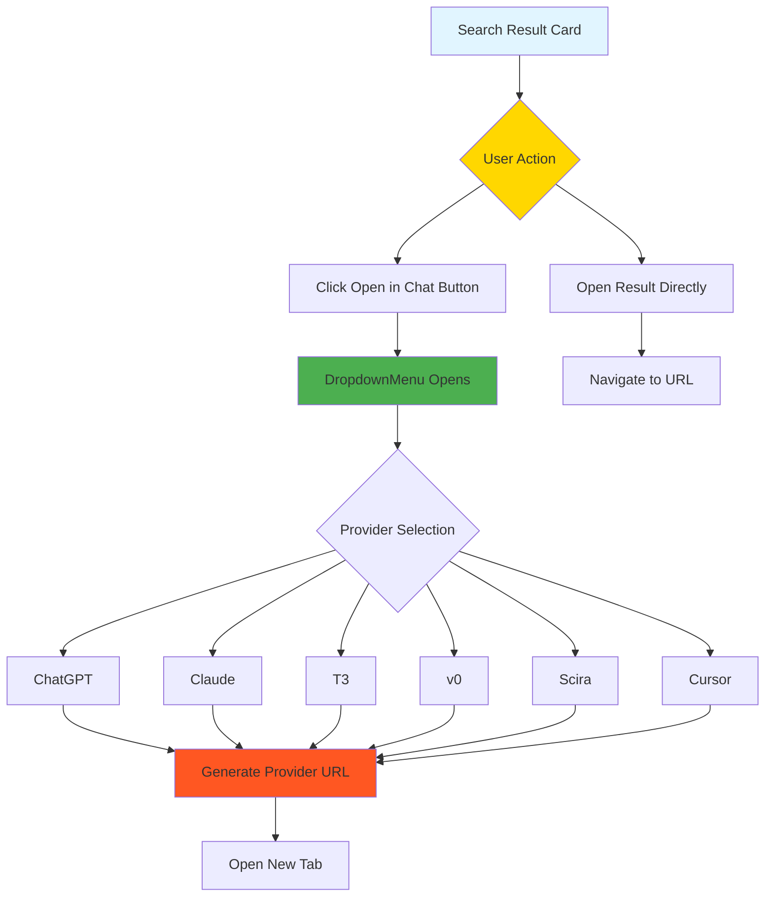
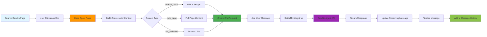
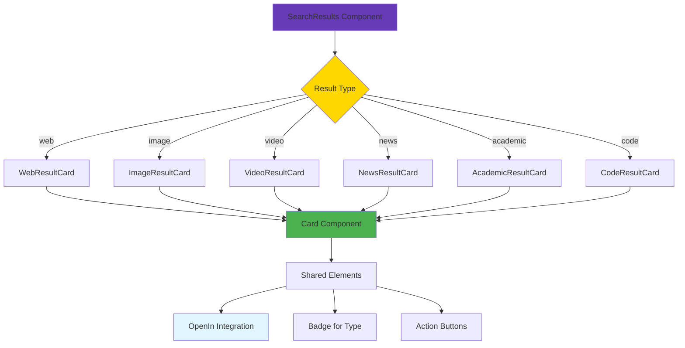

# Search Results Page Design System Blueprint
## Design System & Open-to-Chat Integration Analysis

**Document Created:** 2025-12-30  
**Purpose:** Comprehensive analysis of UI components, Open-to-Chat patterns, and agent integration for building a polymorphic Search Results page.

---

## Table of Contents
1. [UI Component Inventory](#ui-component-inventory)
2. [Catalyst Component Inventory](#catalyst-component-inventory)
3. [Open-to-Chat Pattern Analysis](#open-to-chat-pattern-analysis)
4. [Polymorphic Rendering Patterns](#polymorphic-rendering-patterns)
5. [Agent System Integration Patterns](#agent-system-integration-patterns)
6. [Type Definitions](#type-definitions)
7. [Component Recommendations](#component-recommendations)
8. [Mermaid Diagrams](#mermaid-diagrams)

---

## UI Component Inventory

### Location: `src/components/ui/`

#### **Card** (`card.tsx`)
- **Sub-components:**
  - `Card` - Main container with border, background, shadow
  - `CardHeader` - Container for title/description
  - `CardTitle` - Semibold title text
  - `CardDescription` - Smaller muted description text
  - `CardContent` - Main content area with pt-0 padding
  - `CardFooter` - Action items container
- **Props:** Extends `React.HTMLAttributes<HTMLDivElement>` (standard div props)
- **Styling:** `rounded-xl border bg-card text-card-foreground shadow`
- **Use Case:** Search result cards, containers

#### **Button** (`button.tsx`)
- **Variants:**
  - `default` - Primary action
  - `destructive` - Destructive action
  - `outline` - Bordered, secondary action
  - `secondary` - Secondary style
  - `ghost` - Hover background only
  - `link` - Text link style
- **Sizes:**
  - `default` - h-9 px-4 py-2
  - `sm` - h-8 rounded-md px-3 text-xs
  - `lg` - h-10 rounded-md px-8
  - `icon` - h-9 w-9
- **Props:** `ButtonProps` extends `React.ButtonHTMLAttributes` + `VariantProps<typeof buttonVariants>` + `asChild?: boolean`
- **Use Case:** Open-in-chat triggers, action buttons
- **Pattern:** Uses `@radix-ui/react-slot` for polymorphic behavior

#### **Badge** (`badge.tsx`)
- **Variants:**
  - `default` - Primary color
  - `secondary` - Secondary color
  - `destructive` - Error/danger
  - `outline` - Text only with border
- **Props:** `BadgeProps` extends `React.HTMLAttributes` + `VariantProps`
- **Styling:** `inline-flex items-center rounded-md border px-2.5 py-0.5 text-xs font-semibold`
- **Use Case:** Result types, tags, status indicators

#### **Dropdown Menu** (`dropdown-menu.tsx`)
- **Components:**
  - `DropdownMenu` - Root
  - `DropdownMenuTrigger` - Trigger element
  - `DropdownMenuContent` - Menu container
  - `DropdownMenuItem` - Action item
  - `DropdownMenuCheckboxItem` - Checkable item
  - `DropdownMenuRadioItem` - Radio item
  - `DropdownMenuLabel` - Section label
  - `DropdownMenuSeparator` - Visual divider
  - `DropdownMenuShortcut` - Keyboard shortcut display
- **Pattern:** Uses `@radix-ui/react-dropdown-menu`
- **Use Case:** Filter menus, action menus, open-in-chat providers

#### **Dialog** (`dialog.tsx`)
- **Components:**
  - `Dialog` - Root with state
  - `DialogTrigger` - Trigger element
  - `DialogContent` - Modal content container
  - `DialogHeader` - Title/description container
  - `DialogFooter` - Action container
  - `DialogTitle` - Modal title
  - `DialogDescription` - Modal description
  - `DialogClose` - Close button
- **Pattern:** Uses `@radix-ui/react-dialog`
- **Styling:** `fixed left-[50%] top-[50%] z-50 grid max-w-lg`
- **Use Case:** Modal interactions, expanded views

#### **Select** (`select.tsx`)
- **Components:**
  - `Select` - Root
  - `SelectTrigger` - Trigger button with ChevronDown icon
  - `SelectContent` - Dropdown container
  - `SelectValue` - Display value
  - `SelectItem` - Option item with Check indicator
  - `SelectLabel` - Section label
  - `SelectSeparator` - Divider
- **Pattern:** Uses `@radix-ui/react-select`
- **Use Case:** Sort/filter selection, agent selection

#### **Tooltip** (`tooltip.tsx`)
- **Components:**
  - `Tooltip` - Root
  - `TooltipTrigger` - Hoverable element
  - `TooltipContent` - Tooltip content
- **Pattern:** Uses `@radix-ui/react-tooltip`
- **Styling:** `rounded-md bg-primary text-primary-foreground`
- **Use Case:** Hover help, icon descriptions

#### **Other Notable Components:**
- **Input** (`input.tsx`) - Standard text input with focus ring
- **Textarea** (`textarea.tsx`) - Multi-line input
- **Separator** (`separator.tsx`) - Horizontal/vertical divider
- **Collapsible** (`collapsible.tsx`) - Expand/collapse containers
- **ScrollArea** (`scroll-area.tsx`) - Custom scrollbar container
- **Progress** (`progress.tsx`) - Loading indicators
- **HoverCard** (`hover-card.tsx`) - Popover on hover
- **Alert** (`alert.tsx`) - Warning/info messages
- **ButtonGroup** (`button-group.tsx`) - Grouped buttons
- **InputGroup** (`input-group.tsx`) - Input + icon/button
- **Command** (`command.tsx`) - Command palette
- **Carousel** (`carousel.tsx`) - Image/element carousel

---

## Catalyst Component Inventory

### Location: `src/components/catalyst/`

Catalyst components are **Headless UI** based (using `@headlessui/react`) with sophisticated styling and design tokens.

#### **Button** (`button.tsx`)
- **Styles:**
  - `solid` - Filled with gradient/shadow
  - `outline` - Bordered with hover
  - `plain` - Text-only with hover background
- **Colors:** Extensive color palette (zinc, indigo, cyan, red, orange, amber, etc.)
- **Special Features:**
  - Touch target expansion (44×44px on touch)
  - Optical border implementation
  - Dark mode optimized
- **Props:** `ButtonProps` - Union of variants with specific color prop or outline/plain boolean
- **Pattern:** Extensive use of CSS custom properties (`--btn-bg`, `--btn-border`, etc.)

#### **Combobox** (`combobox.tsx`)
- **Features:**
  - Virtual scrolling support
  - Search/filter functionality
  - Custom icons and descriptions
  - Multi-select ready
- **Sub-components:**
  - `ComboboxOption` - Individual option
  - `ComboboxLabel` - Option label
  - `ComboboxDescription` - Option description
- **Props:** `Combobox<T>` with `displayValue`, `filter`, `anchor`
- **Pattern:** Uses `Headless.Combobox` with virtual scrolling

#### **Dropdown** (`dropdown.tsx`)
- **Sub-components:**
  - `Dropdown` - Root
  - `DropdownButton` - Trigger (can be Button or Link)
  - `DropdownMenu` - Content with grid/subgrid support
  - `DropdownItem` - Action item with icon/slot support
  - `DropdownSection` - Grouped items
  - `DropdownHeading` - Section header
  - `DropdownDivider` - Visual separator
  - `DropdownLabel` - Item label
  - `DropdownDescription` - Item description
  - `DropdownShortcut` - Keyboard shortcut
- **Pattern:** Uses `Headless.Menu` with sophisticated slot system

#### **Other Notable Components:**
- **Avatar** (`avatar.tsx`) - User/agent avatars
- **Badge** (`badge.tsx`) - Status/counter badges
- **Checkbox** (`checkbox.tsx`) - Toggle selection
- **DescriptionList** (`description-list.tsx`) - Key-value pairs
- **Dialog** (`dialog.tsx`) - Modal dialogs
- **Divider** (`divider.tsx`) - Visual separators
- **Fieldset** (`fieldset.tsx`) - Form groups
- **Heading** (`heading.tsx`) - `Heading` (h1-h6) and `Subheading` components
- **Input** (`input.tsx`) - Text inputs
- **Link** (`link.tsx`) - Smart links (with or without underline)
- **Listbox** (`listbox.tsx`) - Selection list
- **Navbar** (`navbar.tsx`) - Navigation bars
- **Pagination** (`pagination.tsx`) - Page navigation
- **Radio** (`radio.tsx`) - Single selection
- **Select** (`select.tsx`) - Dropdown select
- **Sidebar** (`sidebar.tsx`) - Side navigation
- **Switch** (`switch.tsx`) - Toggle switches
- **Table** (`table.tsx`) - Data tables
- **Text** (`text.tsx`) - Typography components
- **Textarea** (`textarea.tsx`) - Multi-line inputs
- **AuthLayout** (`auth-layout.tsx`) - Authentication layouts
- **SidebarLayout** (`sidebar-layout.tsx`) - Sidebar + main content
- **StackedLayout** (`stacked-layout.tsx`) - Stacked panels

---

## Open-to-Chat Pattern Analysis

### File: `src/components/ai-elements/open-in-chat.tsx`

#### **Architecture Pattern**

The Open-to-Chat system uses a **provider context pattern** with specialized dropdown items:

```typescript
// Context Provider
OpenInContext.Provider value={{ query }} wraps DropdownMenu

// Hook for context
useOpenInContext() returns { query }
```

#### **Provider Registry**

The `providers` object (lines 20-184) defines external chat platforms:

```typescript
const providers = {
  github: {
    title: "Open in GitHub",
    createUrl: (url: string) => url,
    icon: <SVG />
  },
  scira: {
    title: "Open in Scira",
    createUrl: (q: string) => `https://scira.ai/?q=${q}`,
    icon: <SVG />
  },
  chatgpt: { title, createUrl: (prompt), icon },
  claude: { title, createUrl: (q), icon },
  t3: { title, createUrl: (q), icon },
  v0: { title, createUrl: (q), icon },
  cursor: { title, createUrl: (text), icon },
}
```

#### **Component Hierarchy**

```
<OpenIn query={string}>           // Root provider
  <DropdownMenu>            // Radix dropdown
    <DropdownMenuTrigger>     // Button with "Open in chat" + ChevronDown
      {children || <Button outline><ChevronDownIcon /></Button>}
    </DropdownMenuTrigger>
    <DropdownMenuContent>    // Aligned start, width 240px
      <DropdownMenuItem>        // Each provider item
        <a href={providers.xxx.createUrl(query)}>
          <span>{icon}</span>
          <span>{title}</span>
          <ExternalLinkIcon />      // Indicates external link
        </a>
      </DropdownMenuItem>
    </DropdownMenuContent>
  </DropdownMenu>
</OpenIn>
```

#### **Data Flow**

1. **Query Prop:** Passed to `OpenIn` component → stored in `OpenInContext`
2. **Context Access:** Each provider component (`OpenInChatGPT`, `OpenInClaude`, etc.) uses `useOpenInContext()` to access query
3. **URL Generation:** Each provider has `createUrl(query)` function that generates platform-specific URL
4. **External Navigation:** Opens in new tab via `target="_blank"` and `rel="noopener"`

#### **Integration Pattern for Search Results**

To integrate Open-to-Chat for search result items:

```tsx
<OpenIn query={result.content}>
  <DropdownMenuTrigger asChild>
    <Button variant="ghost" size="icon">
      <ExternalLinkIcon />
    </Button>
  </DropdownMenuTrigger>
  <DropdownMenuContent>
    <OpenInChatGPT />
    <OpenInClaude />
    <OpenInT3 />
    <OpenInv0 />
    <OpenInScira />
    <OpenInCursor />
  </DropdownMenuContent>
</OpenIn>
```

---

## Polymorphic Rendering Patterns

### Pattern 1: Type-Based Switch Rendering (Conditional)

Found in: `src/components/agent-panel/ContextPicker.tsx`, `src/components/ai-elements/chain-of-thought-enhanced.tsx`

```typescript
// Example from chain-of-thought-enhanced.tsx
{step.type === 'search' && step.searchData && (
  <motion.div>/* Render search results */</motion.div>
)}
{step.type === 'action' && step.actionData && (
  <motion.div>/* Render action data */</motion.div>
)}
```

**Usage:** Simple conditional rendering based on type field

### Pattern 2: Switch-Case Icon Mapping

Found in: `src/components/agent-panel/ContextPicker.tsx`

```typescript
const getIcon = (type: ContextItem['type']) => {
  switch (type) {
    case 'file': return DocumentIcon
    case 'tab': return GlobeAltIcon
    case 'conversation': return ChatBubbleLeftRightIcon
    case 'project': return CodeBracketIcon
    case 'interest': return SparklesIcon
    case 'task': return ClipboardDocumentListIcon
    default: return DocumentIcon
  }
}
```

**Usage:** Function that maps types to icon components

### Pattern 3: Child Type Inspection (Compound Component)

Found in: Multiple components use `child.type` to render specific sub-components

```typescript
// Example from chain-of-thought.tsx
React.Children.forEach(children, child => {
  if (React.isValidElement(child)) {
    if (child.type === ChainOfThoughtHeader) {
      return React.cloneElement(child, { /* enhanced props */ })
    }
    if (child.type === ChainOfThoughtContent) {
      return React.cloneElement(child, { /* enhanced props */ })
    }
  }
})
```

**Usage:** Compound components that wrap and enhance child components

### Pattern 4: Class Variants with CVA

Found in: `src/components/ui/button.tsx`

```typescript
const buttonVariants = cva(
  "inline-flex items-center justify-center...",
  {
    variants: {
      variant: {
        default: "bg-primary...",
        outline: "border border-input...",
        ghost: "hover:bg-accent...",
      },
      size: {
        default: "h-9 px-4 py-2",
        sm: "h-8 rounded-md px-3 text-xs",
      },
    },
    defaultVariants: {
      variant: "default",
      size: "default",
    },
  }
)
```

**Usage:** CVA (class-variance-authority) for type-safe variant classes

### Pattern 5: Polymorphic `asChild` Pattern

Found in: `src/components/ui/button.tsx`, `src/components/ui/dropdown-menu.tsx`

```typescript
export interface ButtonProps extends React.ButtonHTMLAttributes {
  asChild?: boolean  // Allows polymorphic rendering
}

const Button = React.forwardRef<HTMLButtonElement, ButtonProps>(
  ({ asChild = false, ...props }, ref) => {
    const Comp = asChild ? Slot : "button"  // Slot renders child as-is
    return <Comp className={cn(buttonVariants(...))} ref={ref} {...props} />
  }
)
```

**Usage:** Components can render as any valid HTML element when passed with `asChild`

### Recommended Pattern for Search Results Polymorphic Cards

```typescript
// Type definition for different result types
type SearchResultType = 'web' | 'image' | 'video' | 'news' | 'academic' | 'code'

// Result data structure
interface SearchResult {
  id: string
  type: SearchResultType
  title: string
  url: string
  snippet: string
  metadata: {
    date?: string
    source?: string
    [key: string]: unknown
  }
}

// Component with type-based rendering
function SearchResultsItem({ result }: { result: SearchResult }) {
  switch (result.type) {
    case 'web': return <WebResultCard result={result} />
    case 'image': return <ImageResultCard result={result} />
    case 'video': return <VideoResultCard result={result} />
    // ... more cases
  }
}
```

---

## Agent System Integration Patterns

### File: `src/stores/agentStore.ts`

#### **Store Architecture**

Uses **Zustand** for state management with the following state shape:

```typescript
interface AgentState {
  // Panel state
  isPanelOpen: boolean
  interactionMode: 'voice' | 'text'
  
  // Agent state
  isListening: boolean
  isSpeaking: boolean
  isThinking: boolean
  isStreaming: boolean
  
  // Vision state
  isViewingScreen: boolean
  screenshotData: string | null
  
  // Conversation state
  activeConversationId: string | null
  conversations: Record<string, Conversation>
  messages: Message[]
  
  // Streaming state
  currentStreamingMessage: string | null
  currentToolUse: ToolUse | null
  streamId: string | null
  
  // Connection state
  connectionStatus: 'connected' | 'connecting' | 'disconnected' | 'error'
  error: { code: string; message: string } | null
  
  // Ask Ron state
  askRonStep: AskRonStep
  askRonSelectedText: string | null
  askRonSourceUrl: string | null
  askRonOptions: AskRonOption[]
  askRonThinkingText: string
  
  // Actions (methods)
  togglePanel: () => void
  openPanel: () => void
  closePanel: () => void
  setInteractionMode: (mode) => void
  sendMessage: (content, context?) => Promise<void>
  // ... more actions
}
```

#### **Message Flow for Routing Content to Agents**

```typescript
// Sending a message with context
const sendMessage = async (content: string, context?: ConversationContext) => {
  // 1. Add user message immediately
  addMessage('user', content)
  
  // 2. Set thinking state
  set({ isThinking: true, connectionStatus: 'connecting' })
  
  // 3. Generate streamId for tracking
  const streamId = generateId()
  
  // 4. Build request payload
  const request: ChatRequest = {
    prompt: content,
    conversationId: state.activeConversationId || undefined,
    context,  // <-- Context passed here
    stream: true,
  }
  
  // 5. Send via Electron IPC or direct fetch
  if (window.electron?.agent) {
    await window.electron.agent.startStream(streamId, {
      url: `${API_BASE_URL}${API_ENDPOINTS.agent.stream}`,
      method: 'POST',
      headers: { 'Content-Type': 'application/json', 'Authorization': `Bearer ${token}` },
      body: JSON.stringify(request),
    })
  }
}
```

#### **Context Structure for Agent Integration**

```typescript
interface ConversationContext {
  // User context from onboarding
  userInterests?: string[]
  userPreferences?: Record<string, unknown>
  
  // Session context
  currentUrl?: string
  pageContent?: string
  selectedText?: string
  
  // Agent context
  agentId?: string
  agentName?: string
}
```

### File: `src/types/agent.ts`

#### **Type Definitions**

```typescript
// Message Types
interface Message {
  id: string
  role: 'user' | 'assistant' | 'system'
  content: string
  timestamp: number
  isStreaming?: boolean
  streamedContent?: string
  toolUses?: ToolUse[]
  model?: string
  tokens?: TokenUsage
  stopReason?: StopReason
}

// Tool Usage
interface ToolUse {
  id: string
  name: string
  input?: Record<string, unknown>
  result?: ToolResult
  status: 'pending' | 'running' | 'success' | 'error'
  startedAt?: number
  completedAt?: number
}

// Streaming Events (SSE)
interface AgentStreamEvent {
  data?: string              // Text content
  reasoningText?: string        // Chain of thought
  current_tool_use?: {        // Tool being used
    id?: string
    name?: string
    input?: Record<string, unknown>
  }
  complete?: boolean           // Stream complete
  force_stop?: boolean        // Stopped by user
  result?: AgentResult       // Final result
}
```

### Agent Integration Pattern for Search Results

```typescript
// Open agent panel with search result context
const openSearchResultInChat = (result: SearchResult) => {
  // Open the agent panel
  openPanel()
  
  // Build context from search result
  const context: ConversationContext = {
    type: 'search_result',
    sourceUrl: result.url,
    selectedText: result.title + '\n' + result.snippet,
    metadata: result.metadata,
  }
  
  // Build prompt
  const prompt = `Help me understand this search result:\n\n${result.title}\n\n${result.snippet}\n\nSource: ${result.url}`
  
  // Send message with context
  sendMessage(prompt, context)
}
```

---

## Type Definitions

### Agent-Related Types (`src/types/agent.ts`)

```typescript
// Core types for Search Results integration
export type AgentId = 'ron' | 'coding-agent' | 'browser-agent' | 'researcher'

export interface Message {
  id: string
  role: 'user' | 'assistant' | 'system'
  content: string
  timestamp: number
  isStreaming?: boolean
  toolUses?: ToolUse[]
  model?: string
  tokens?: TokenUsage
  stopReason?: StopReason
}

export interface ConversationContext {
  userInterests?: string[]
  userPreferences?: Record<string, unknown>
  currentUrl?: string
  pageContent?: string
  selectedText?: string
  agentId?: string
  agentName?: string
}

export interface ChatRequest {
  prompt: string
  conversationId?: string
  systemPrompt?: string
  context?: ConversationContext
  stream?: boolean
  model?: string
  temperature?: number
  maxTokens?: number
  tools?: string[]
}
```

### Context Item Types (`src/components/agent-panel/ContextPicker.tsx`)

```typescript
export interface ContextItem {
  id: string
  type: 'file' | 'tab' | 'conversation' | 'project' | 'interest' | 'task'
  name: string
  description?: string
  icon?: React.ComponentType<{ className?: string }>
  meta?: string  // e.g., "2 hours ago", "3 files"
  color?: string
}
```

### Recommended Types for Search Results

```typescript
// Result type discriminator
export type SearchResultType = 
  | 'web'      // Standard web pages
  | 'image'    // Image results
  | 'video'    // Video results
  | 'news'     // News articles
  | 'academic'  // Research papers
  | 'code'      // Code snippets/repositories

// Search result interface
export interface SearchResult {
  id: string
  type: SearchResultType
  title: string
  url: string
  snippet: string
  thumbnail?: string
  metadata: {
    domain?: string
    date?: string
    author?: string
    rating?: number
    language?: string
    tags?: string[]
    [key: string]: unknown
  }
}

// Search results container
export interface SearchResults {
  query: string
  results: SearchResult[]
  totalCount: number
  filters?: SearchFilters
}

// Filters
export interface SearchFilters {
  type?: SearchResultType | 'all'
  dateRange?: 'any' | 'day' | 'week' | 'month' | 'year'
  sortBy?: 'relevance' | 'date' | 'rating'
}
```

---

## Component Recommendations

### Recommended Components for Search Results Interface

#### **Card Container**
- **Component:** [`Card`](src/components/ui/card.tsx)
- **Sub-components:** `CardHeader`, `CardTitle`, `CardDescription`, `CardContent`, `CardFooter`
- **Usage:**
```tsx
<Card>
  <CardHeader>
    <CardTitle>{result.title}</CardTitle>
    <CardDescription>{result.metadata.domain}</CardDescription>
  </CardHeader>
  <CardContent>
    <p>{result.snippet}</p>
  </CardContent>
  <CardFooter>
    <OpenIn query={result.content}>
      {/* Open in chat dropdown */}
    </OpenIn>
  </CardFooter>
</Card>
```

#### **Action Buttons**
- **Component:** [`Button`](src/components/ui/button.tsx) from `src/components/ui`
- **Variants:** `ghost` (secondary), `outline` (tertiary), `default` (primary)
- **Sizes:** `sm` for compact, `default` for normal
- **Usage:**
```tsx
<Button variant="outline" size="sm">Open</Button>
<Button variant="ghost" size="icon">
  <ShareIcon />
</Button>
```

#### **Dropdown Menus**
- **Component:** [`DropdownMenu`](src/components/ui/dropdown-menu.tsx)
- **Use Case:** Filter menu, sort menu, open-in-chat providers
- **Pattern:** Use with `asChild` for custom triggers

#### **Badges & Tags**
- **Component:** [`Badge`](src/components/ui/badge.tsx)
- **Variants:** `default` (primary), `secondary` (neutral), `outline` (subtle)
- **Use Case:** Result type indicators, source badges

#### **Catalyst Components (For Enhanced UI)**
- **Button** ([`src/components/catalyst/button.tsx`](src/components/catalyst/button.tsx)) - Sophisticated gradient/solid buttons
- **Dropdown** ([`src/components/catalyst/dropdown.tsx`](src/components/catalyst/dropdown.tsx)) - Complex dropdowns with subgrid
- **Avatar** ([`src/components/catalyst/avatar.tsx`](src/components/catalyst/avatar.tsx)) - User/agent avatars

---

## Mermaid Diagrams

### Open-to-Chat Integration Flow



### Agent Integration Flow



### Polymorphic Rendering Pattern



---

## Implementation Guidelines

### 1. Using the Open-to-Chat Pattern

**Do's:**
- Wrap your search result content in `<OpenIn query={content}>`
- Use `<DropdownMenuTrigger asChild>` with a button
- Include `ExternalLinkIcon` in each menu item to indicate external links
- Use `target="_blank"` and `rel="noopener"` for external navigation

**Don't:**
- Don't include internal routing (this is for external platforms)
- Don't modify the provider registry unless adding a new platform
- Don't forget to pass the actual content, not just the title

### 2. Polymorphic Card Rendering

**Do's:**
- Use a `type` field to discriminate between result types
- Create specific card components for each result type (`WebResultCard`, `ImageResultCard`, etc.)
- Use a switch statement or map for type-based rendering
- Extract common elements into shared components (e.g., `ResultCardBase`)

**Don't:**
- Don't use `any` types - use discriminated unions
- Don't forget default/fallback cases in switch statements
- Don't duplicate code - extract shared patterns

### 3. Agent Integration

**Do's:**
- Use `useAgentStore()` hook to access agent state and actions
- Build proper `ConversationContext` when sending messages
- Include source URL and content in the context
- Use `sendMessage(content, context)` for proper routing to agents
- Handle loading, thinking, and error states

**Don't:**
- Don't bypass the store - use the provided actions
- Don't forget to handle streaming state
- Don't send sensitive data without proper context

### 4. Styling Guidelines

**Do's:**
- Use Tailwind CSS utility classes
- Use `cn()` from `@/lib/utils` for conditional classes
- Follow the existing design tokens (colors, spacing, radius)
- Use framer-motion for animations
- Use the `cn()` helper for merging class names

**Design Tokens:**
- Primary accent: `accent` / `accent-light` (dark mode)
- Backgrounds: `surface-0` through `surface-900`
- Text: `ink` / `ink-inverse` (dark mode)
- Borders: `surface-200` / `surface-700`
- Radius: `rounded-lg`, `rounded-xl`, `rounded-2xl`

---

## Missing Pieces & Questions

### Clarification Needed

1. **Search Result Data Structure:**
   - What is the expected API response format for search results?
   - Are result types predetermined or dynamically determined?
   - What metadata fields should be displayed?

2. **Agent Routing:**
   - Which agent should handle search results? (Ron, Browser Agent, Researcher?)
   - Should users be able to select the agent?
   - Are there specific prompts/templates for different result types?

3. **Open-in-Chat Expansion:**
   - Should we add "Open in Ron Browser" to the provider list?
   - Are there plans for a custom agent integration (beyond external platforms)?
   - Should the context include related results or just the selected item?

4. **Polymorphic Behavior:**
   - Should results be filterable by type?
   - Should users be able to change result type display mode (grid vs list)?
   - Are there any special result types beyond web/image/video/news/academic/code?

---

## Quick Reference

### Import Statements

```typescript
// UI Components
import { Card, CardHeader, CardTitle, CardDescription, CardContent, CardFooter } from '@/components/ui/card'
import { Button } from '@/components/ui/button'
import { Badge } from '@/components/ui/badge'
import { DropdownMenu, DropdownMenuTrigger, DropdownMenuContent, DropdownMenuItem } from '@/components/ui/dropdown-menu'
import { Tooltip, TooltipTrigger, TooltipContent } from '@/components/ui/tooltip'

// Open-in-Chat
import { OpenIn, OpenInTrigger, OpenInContent, OpenInChatGPT, OpenInClaude, OpenInT3, OpenInv0, OpenInScira, OpenInCursor } from '@/components/ai-elements/open-in-chat'

// Agent Store
import { useAgentStore } from '@/stores/agentStore'

// Types
import type { ConversationContext } from '@/types/agent'
```

### Component Structure Template

```tsx
import { Card, CardHeader, CardTitle, CardDescription, CardContent, CardFooter } from '@/components/ui/card'
import { Button } from '@/components/ui/button'
import { Badge } from '@/components/ui/badge'
import { ExternalLinkIcon, MessageCircleIcon } from 'lucide-react'
import { OpenIn, OpenInTrigger, OpenInContent, OpenInChatGPT, OpenInClaude } from '@/components/ai-elements/open-in-chat'
import { useAgentStore } from '@/stores/agentStore'
import { cn } from '@/lib/utils'

type SearchResultType = 'web' | 'image' | 'video' | 'news'

interface SearchResult {
  id: string
  type: SearchResultType
  title: string
  url: string
  snippet: string
  metadata?: Record<string, unknown>
}

function WebResultCard({ result }: { result: SearchResult }) {
  const { openPanel, sendMessage } = useAgentStore()
  
  const handleAskRon = () => {
    openPanel()
    const context: ConversationContext = {
      type: 'search_result',
      sourceUrl: result.url,
      selectedText: result.title + '\n' + result.snippet,
    }
    sendMessage('Help me understand this result', context)
  }
  
  return (
    <Card className="group hover:shadow-lg transition-shadow">
      <CardHeader>
        <div className="flex items-start justify-between gap-3">
          <div className="flex-1">
            <CardTitle className="line-clamp-2">{result.title}</CardTitle>
            <CardDescription>{result.metadata?.domain}</CardDescription>
          </div>
          <Badge variant="outline">Web</Badge>
        </div>
      </CardHeader>
      <CardContent>
        <p className="text-sm text-muted-foreground line-clamp-3">
          {result.snippet}
        </p>
      </CardContent>
      <CardFooter className="flex items-center justify-between">
        <OpenIn query={result.title + ': ' + result.snippet}>
          <DropdownMenuTrigger asChild>
            <Button variant="ghost" size="icon">
              <MessageCircleIcon className="w-4 h-4" />
            </Button>
          </DropdownMenuTrigger>
          <DropdownMenuContent align="start">
            <OpenInChatGPT />
            <OpenInClaude />
          </DropdownMenuContent>
        </OpenIn>
        <Button variant="outline" size="sm" onClick={handleAskRon}>
          Ask Ron
        </Button>
      </CardFooter>
    </Card>
  )
}
```

---

**Document Status:** Complete  
**Ready for Implementation:** Yes  
**Requires User Clarification:** See "Missing Pieces & Questions" section
